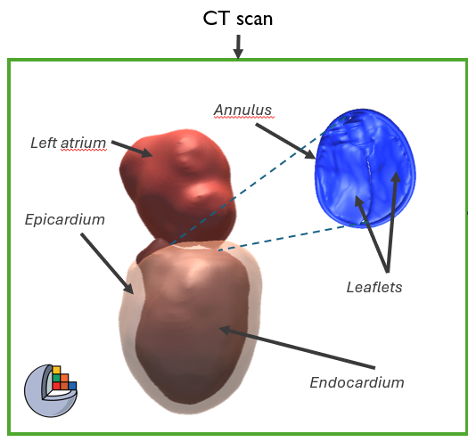
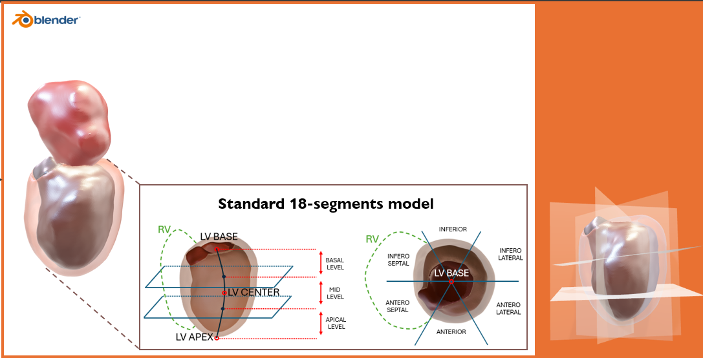
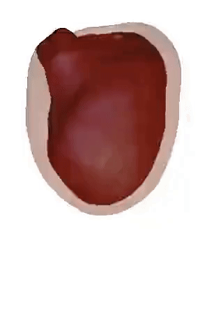
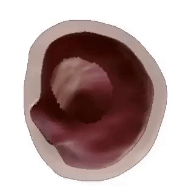
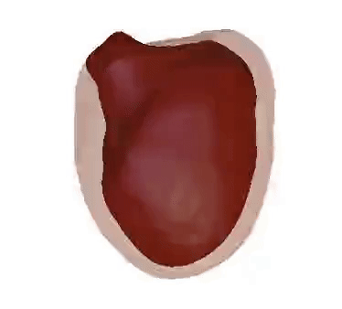
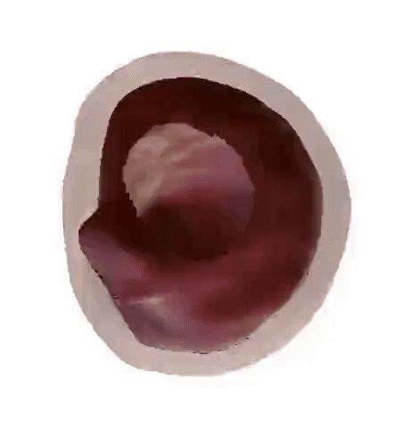
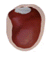
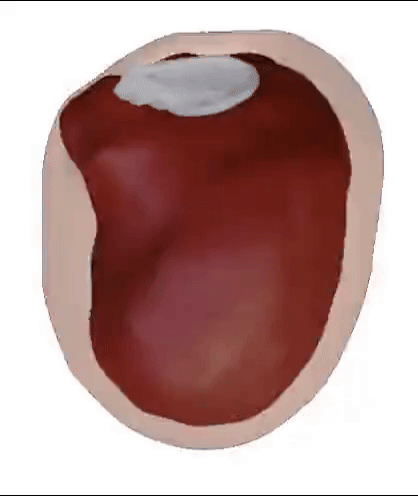
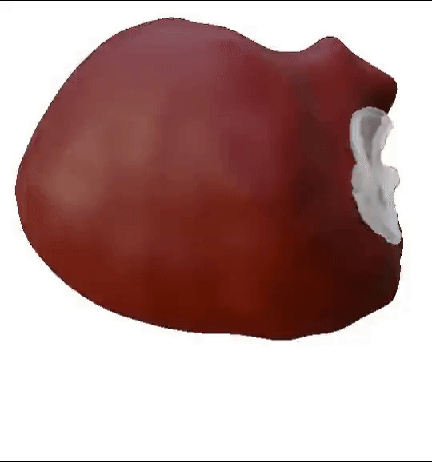

# StrainBased-LV

## Project Overview

The model aims to provide a realistic simulation of heart motion by utilizing strain data obtained through Speckle Tracking Echocardiography (STE). It is designed to be computationally efficient, making it suitable for real-time applications across various clinical scenarios. The model focuses on the left ventricle (LV) and mitral valve (MV) modeling.

## Methodology

1. **Static Mesh Segmentation**: Divide a computerized tomography scan into anatomical regions, such as the left ventricle, mitral valve, and left atrium.
2. **Regional subdivision**: Divide the LV into anatomical regions according to [1].
3. **Geometric Deformations**: Apply deformations based on STE data to simulate heart motion.
4. **Motion Simulation**: Integrate the model into a simulator to visualize heart motion throughout the cardiac cycle.

### Static mesh segmentation

Segmentation of the LV and MV structures, including the endocardium, epicardium, annular plane, and valve leaflets, was performed using Slicer3D (v. 5.8.0 - https://download.slicer.org/)

### Regional subdivision

Each region was assigned to a distinct group of vertices on the LV mesh in Blender (v  - https://www.blender.org/download/). From short-axis echocardiographic views, basal, mid, and apical levels were identified. Each level was further split into six regions based on long-axis echocardiographic views in 2-chamber, 3-chamber, and 4-chamber perspectives. 
To establish a local coordinate system aligned with the anatomical axes, the z-axis was defined along the apex-to-base direction, representing the direction of longitudinal strain (LS). The x- and y-axes were set in the transverse plane to account for circumferential (CS) and radial strain (RS).

### Geometrical Deformations
|  |  |  |  |  |
|:--------------------------------------------:|:--------------------------------------------:|:--------------------------------------------:|:--------------------------------------------:|:--------------------------------------------:|
| LS - LV                             | CS - LV                             | CS - LV                            | RS - LV                             | RS - LV                            |
|  |  |  |                                              |                                              |
| LS - MV                            | CS - MV                             | RS - MV                             | 

## References
1. J.-U. Voigt, G. Pedrizzetti, P. Lysyansky, et al., “Definitions for a common standard for 2d speckle tracking echocardiography: Consensus document of the eacvi/ase/industry task force to standardize deformation imaging,” European Heart Journal - Cardiovascular Imaging, vol. 16, no. 1, pp. 1–11, Dec. 2014, ISSN: 2047-2404. DOI: 10.1093/ehjci/jeu184
