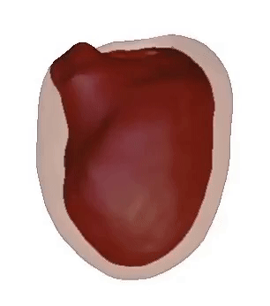
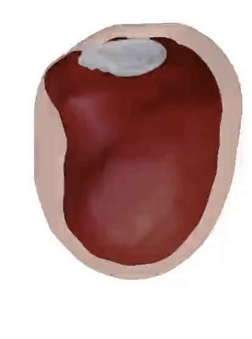
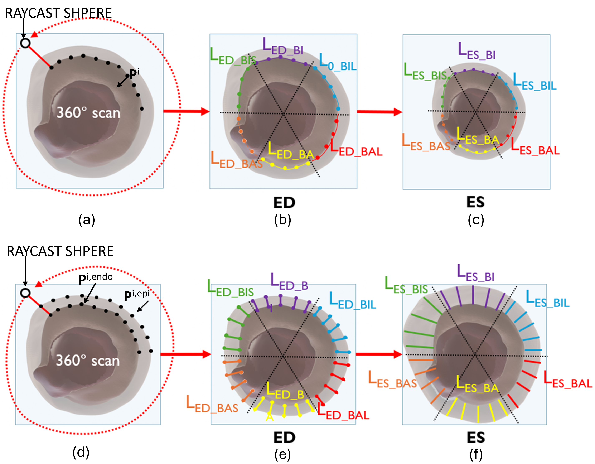

# StrainBased-LV

## Project Overview

The model aims to provide a realistic simulation of heart motion by utilizing strain data obtained through Speckle Tracking Echocardiography (STE). It is designed to be computationally efficient, making it suitable for real-time applications across various clinical scenarios. The model focuses on the left ventricle (LV) and mitral valve (MV) modeling.

## Methodology

1. **Static Mesh Segmentation**: Divide a computerized tomography scan into anatomical regions, such as the left ventricle, mitral valve, and left atrium.
2. **Regional subdivision**: Divide the LV into anatomical regions according to [1].
3. **Geometric Deformations**: Apply deformations based on STE data to simulate heart motion.
4. **Motion Simulation**: Integrate the model into a simulator to visualize heart motion throughout the cardiac cycle.

### Static mesh segmentation

  

Segmentation of the LV and MV structures, including the endocardium, epicardium, annular plane, and valve leaflets, was performed using Slicer3D (v. 5.8.0 - https://download.slicer.org/)

### Regional subdivision

  

Each region was assigned to a distinct group of vertices on the LV mesh in Blender (v  - https://www.blender.org/download/). From short-axis echocardiographic views, basal, mid, and apical levels were identified. Each level was further split into six regions based on long-axis echocardiographic views in 2-chamber, 3-chamber, and 4-chamber perspectives. 
To establish a local coordinate system aligned with the anatomical axes, the z-axis was defined along the apex-to-base direction, representing the direction of longitudinal strain (LS). The x- and y-axes were set in the transverse plane to account for circumferential (CS) and radial strain (RS).

### Geometrical Deformations
|  |  |  |  |  |
|:--------------------------------------------:|:--------------------------------------------:|:--------------------------------------------:|:--------------------------------------------:|:--------------------------------------------:|
| LS - LV                             | CS - LV                             | CS - LV                            | RS - LV                             | RS - LV                            |

|  |  |  |
|:--------------------------------------------:|:--------------------------------------------:|:--------------------------------------------:|
| LS - MV                    | CS - MV                      | RS - MV                      |

## Validation
To compute the initial (LED) and final (LES) quantities required from equation 2, we employed a raycasting technique. A rotating sphere emitted rays toward the center of predefined planes, designed to simulate standard echocardiographic views (Fig. 4a-d). The intersection points (pi ∈ R3) on the LV surface were recorded and mapped to the nearest mesh vertices. These vertices were grouped according to the regional subdivisions outlined in Section II-A. This process facilitated the determination of LED in the initial, undeformed geometry (ED) (Fig. 4b-e). Subsequently, the mesh was deformed to represent ES deformation by adjusting the strain curve to theoretical ϵPSS values, and the raycasting procedure was repeated to obtain LES (Fig. 4c-f). For longitudinal and circumferential ϵPSS, LED and LES corresponded to the lengths of the endocardial regional profiles (Fig. 4b). These were computed by fitting Bézier splines through the selected vertices at ED and ES using Unity’s Splines package. In contrast, for radial ϵPSS, LED and LES represented the thicknesses between the endocardium and epicardium (Fig. 4e). These were calculated by averaging the distances between corresponding vertex pairs, expressed as ∥pi,endo − pi,epi∥.

  

See video:

## LV simulation
Final result:

## References
1. J.-U. Voigt, G. Pedrizzetti, P. Lysyansky, et al., “Definitions for a common standard for 2d speckle tracking echocardiography: Consensus document of the eacvi/ase/industry task force to standardize deformation imaging,” European Heart Journal - Cardiovascular Imaging, vol. 16, no. 1, pp. 1–11, Dec. 2014, ISSN: 2047-2404. DOI: 10.1093/ehjci/jeu184
